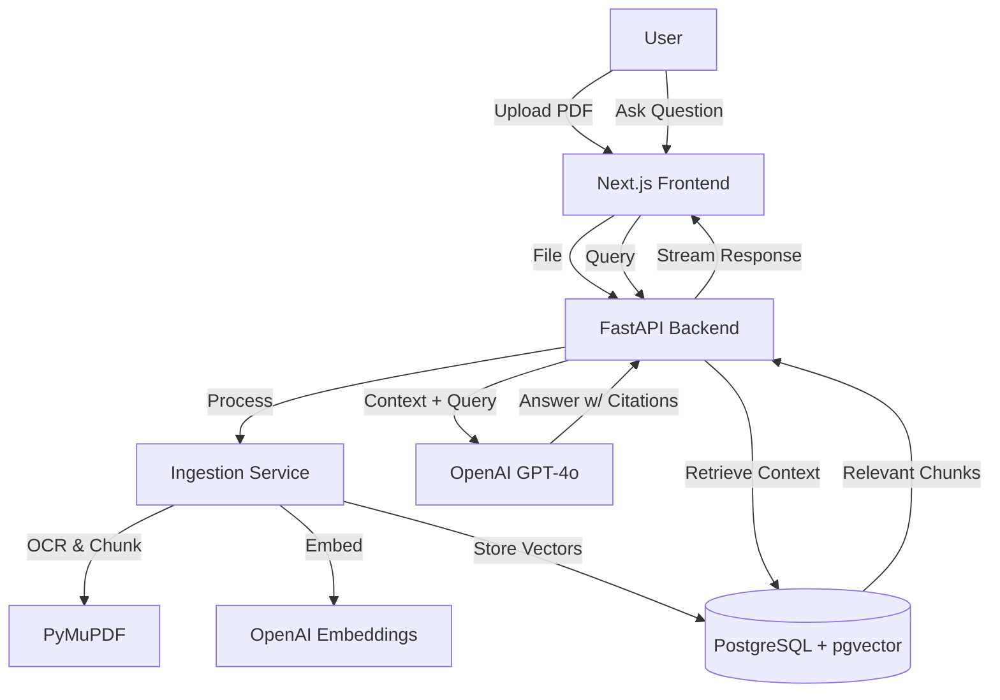

# Documind.ai

> **Intelligent Document Intelligence for Professionals**
>
> *Answer complex client questions in minutes, not hours. Trusted, auditable citation for every claim.*


## 🚀 The Problem
Insurance brokers, legal analysts, and compliance officers spend **40% of their day** control-F'ing through 100+ page density-rich PDF documents. This manual workflow is:
1.  **Slow**: Finding specific clauses takes minutes.
2.  **Error-Prone**: IMPORTANT context is often missed in localized searches.
3.  **Unverifiable**: LLM summaries often hallucinate without source backing.

## 💡 The Solution: Documind.ai
Documind.ai is a **RAG-powered PDF Copilot** that transforms static documents into an interactive knowledge base.

*   **🔍 Grounded Answers**: Every AI response cites specific pages and quotes from the document.
*   **📑 Professional Viewer**: A full-featured PDF viewer with highlighting, sticky notes, and rich-text editing.
*   **⚡ Instant Navigation**: Click a citation to jump instantly to the source paragraph.
*   **🛡️ Secure & Private**: Documents are processed primarily in-memory or secure localized storage.

---

## 🏗️ Architecture

Documind.ai uses a modern Retrieval-Augmented Generation (RAG) pipeline to ensure accuracy.



### Technology Stack
*   **Frontend**: Next.js 14, React, Tailwind CSS, Framer Motion, pdf.js
*   **Backend**: FastAPI (Python 3.9+), SQLAlchemy, PyMuPDF
*   **Database**: PostgreSQL 15+ (with `pgvector` extension)
*   **AI Engine**: OpenAI GPT-4o, text-embedding-3-small

---

## 🛠️ Quick Start

### 1. Prerequisites
- **Docker** & Docker Compose (Recommended)
- **OpenAI API Key**

### 2. Run with Docker (Easiest)
```bash
# Clone the repository
git clone https://github.com/atharvayeola/Documind.ai.git
cd Documind.ai

# Set your API Key
# Create a .env file based on the example
echo "OPENAI_API_KEY=sk-your-key-here" > backend/.env
# Note: You may need to copy other vars from backend/.env.example

# Start the application
docker-compose up --build
```
Access the application at `http://localhost:3000`.

### 3. Manual Development Setup

<details>
<summary>Click to view manual setup steps</summary>

#### Database
You need a PostgreSQL instance with `pgvector` enabled.
```bash
docker run -d --name documind-db -e POSTGRES_PASSWORD=postgres -p 5432:5432 pgvector/pgvector:pg16
```

#### Backend
```bash
cd backend
python3 -m venv venv
source venv/bin/activate
pip install -r requirements.txt
cp .env.example .env  # Add your API Key
uvicorn main:app --reload
```

#### Frontend
```bash
cd frontend
npm install
npm run dev
```
</details>

---

## 🌟 Key Features

| Feature | Description |
|:---|:---|
| **Smart Citations** | Clickable references [Page 12] that jump to the exact location. |
| **Deep Search** | Vector semantic search finds meaning, not just keywords. |
| **Rich Annotation** | Highlight text, add sticky notes, and edit overlay text directly on the PDF. |
| **Export Analysis** | Download chat transcripts or burn annotations into a new PDF file. |

---

## 🔒 Security & Privacy
*   **No Training**: Your data is never used to train OpenAI models (Enterprise API usage).
*   **Ephemeral Storage**: In standard configuration, uploaded files can be configured to auto-expire.

---

## 📄 License
MIT License. Free for open-source use.
